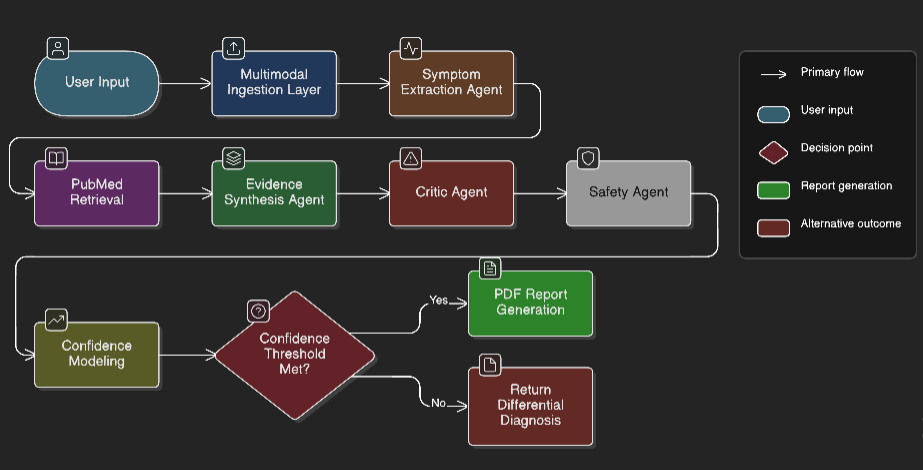
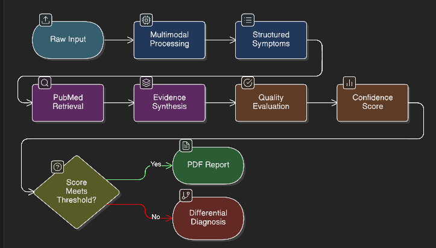
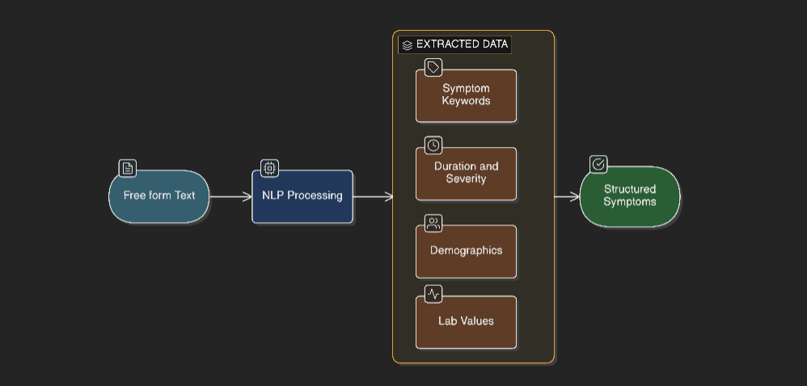
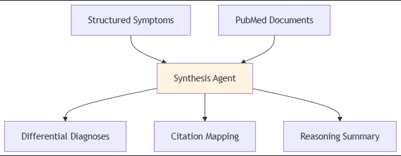
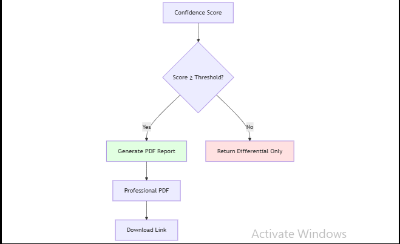
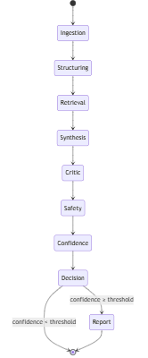
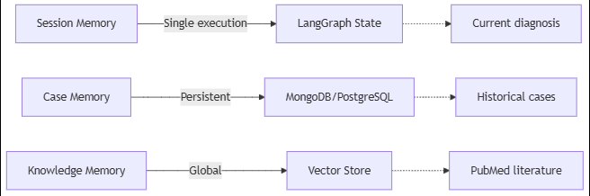

# MedRAG: Clinical Decision Support Agent

**A multimodal, literature-grounded diagnostic system built with FastAPI, LangChain, and LangGraph**

---

## System Overview

MedRAG is a domain-constrained, tool-augmented agentic system that processes multimodal clinical inputs, retrieves biomedical evidence from PubMed, and generates structured differential diagnoses with deterministic confidence scoring. The system enforces safety gates and conditional PDF report generation based on reliability thresholds.

**Key Characteristics:**
- Multimodal input processing (text, audio, image, PDF, DOCX)
- Evidence-grounded reasoning with citation validation
- Deterministic confidence modeling
- Structured state management via LangGraph
- Safety-first design with red flag detection

---

## System Architecture



---

## Execution Flow


---

## Core Components

### 1. Multimodal Ingestion Layer

Processes diverse input formats into unified text representation:

| Agent | Input Type | Output |
|-------|-----------|--------|
| Text Processor | Plain text | Normalized text |
| Audio Transcriber | Audio files | Transcribed text |
| Image Processor | Images | OCR/Vision extraction |
| PDF Processor | PDF documents | Extracted text + metadata |
| DOCX Processor | Word documents | Structured content |

**Output Schema:** `StructuredSymptoms`

---

### 2. Symptom Extraction Agent

Converts free-form medical descriptions into structured clinical data:


**Extracted Fields:**
- Symptom keywords & codes
- Duration & severity
- Patient demographics
- Laboratory values
- Medical history

---

### 3. PubMed Retrieval Layer

Retrieves relevant biomedical literature using semantic search:

**Components:**
- PubMed API integration (LangChain)
- Embedding model for semantic matching
- Vector store (FAISS/Chroma)
- Optional reranker for precision

**Output:** Top-k relevant abstracts with metadata (DOI, year, journal, relevance score)

---

### 4. Evidence Synthesis Agent

Generates differential diagnoses grounded in retrieved literature:



**Output:** `DiagnosisOutput` with supporting citations

---

### 5. Critic Agent

Evaluates reasoning quality and validates evidence grounding:

**Evaluation Criteria:**
- Citation grounding validity
- Claim-evidence alignment
- Hallucination detection
- Reasoning coherence

**Outputs:**
- `critic_score`: Reasoning quality metric
- `hallucination_penalty`: Unsupported claims penalty
- `citation_score`: Evidence alignment score

---

### 6. Safety Agent

Detects critical symptoms requiring immediate medical attention:

**Functions:**
- Red flag symptom detection (stroke, MI, severe trauma)
- Emergency escalation flagging
- Mandatory disclaimer injection

**Output:** `red_flag_penalty` + safety annotations

---

### 7. Confidence Modeling (Deterministic)

Computes final confidence score using weighted formula:

```
confidence = w₁·retrieval_score + 
             w₂·citation_score + 
             w₃·critic_score + 
             w₄·evidence_consistency −
             w₅·hallucination_penalty −
             w₆·red_flag_penalty
```

**Score Range:** [0, 1] (clamped)

---

### 8. Conditional Report Generation




**PDF Report Contents:**
- Patient demographics
- Symptom summary
- Differential diagnoses (ranked)
- Supporting citations
- Risk flags & confidence score
- Medical disclaimer

---

## LangGraph Orchestration




**State Management:**
- Typed graph state with strict schemas
- Deterministic node transitions
- Conditional edge routing
- Full execution traceability

---

## Memory Architecture





| Memory Type | Scope | Storage | Content |
|-------------|-------|---------|---------|
| **Session** | Single execution | LangGraph state | Symptoms, documents, scores |
| **Case** | Persistent | Database | Case history, reports |
| **Knowledge** | Global | Vector DB | PubMed embeddings |

---

## Reliability Strategy

The system enforces production-grade reliability through:

1. **Structured Schemas** – Pydantic validation at every stage
2. **Citation Validation** – Every claim mapped to evidence
3. **Hallucination Detection** – Critic agent verification
4. **Deterministic Scoring** – Formula-based confidence (no LLM uncertainty)
5. **Safety Gating** – Red flag detection prevents unsafe outputs
6. **Audit Logging** – Full execution trace for compliance

---

## Design Principles

| Principle | Implementation |
|-----------|----------------|
| **Modularity** | Agents with single responsibilities |
| **Separation of Concerns** | API ≠ Business Logic ≠ Orchestration |
| **Determinism** | Explicit confidence calculation |
| **Safety-First** | Multiple validation layers |
| **Auditability** | Structured logging at each node |
| **Privacy** | HIPAA-compliant data handling |

---

## Technology Stack

- **API Framework:** FastAPI
- **Orchestration:** LangGraph
- **LLM Integration:** LangChain
- **Vector Store:** FAISS / Chroma
- **Database:** MongoDB / PostgreSQL
- **Retrieval:** PubMed API
- **Validation:** Pydantic

---

## System Classification

**MedRAG is a domain-constrained, tool-augmented, evaluation-driven agentic system.**

It is not a chatbot. It is a structured clinical decision support agent with:
- Modular multi-agent orchestration
- Evidence-based reasoning enforcement
- Deterministic confidence modeling
- Conditional execution logic
- Production-grade reliability controls

---

## Future Extensions

- **Multi-turn dialogue** for symptom clarification
- **Explainability module** with reasoning visualization
- **Feedback loop** for model improvement
- **Integration with EHR systems**
- **Multi-language support**

---

*This architecture enables scalable, auditable, and reliable AI-assisted clinical decision support.*